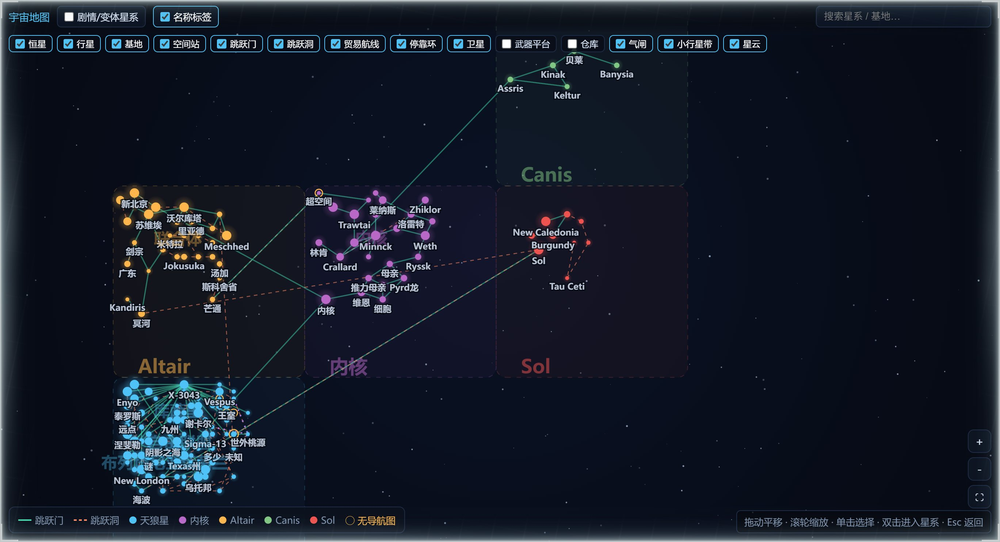
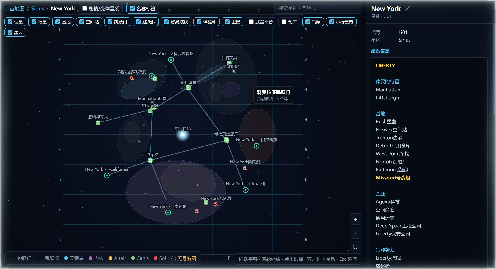
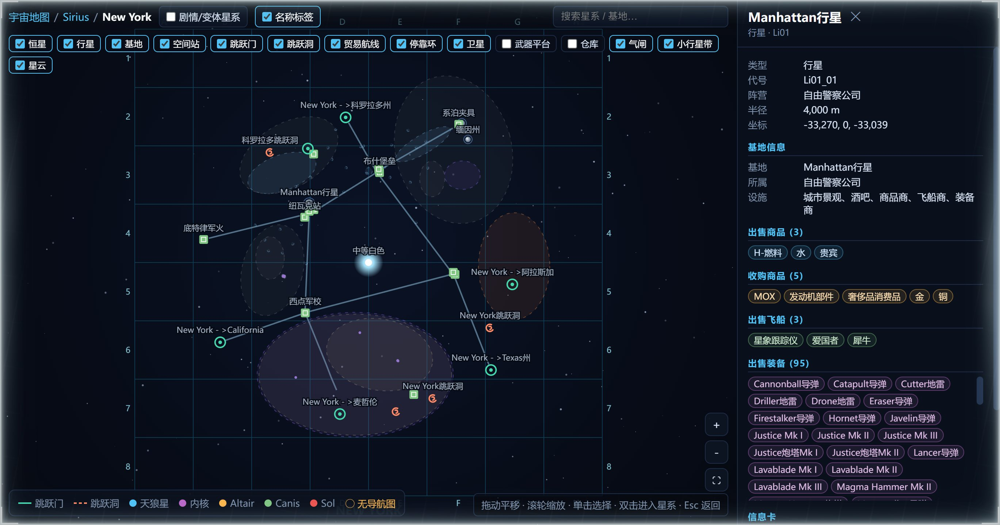
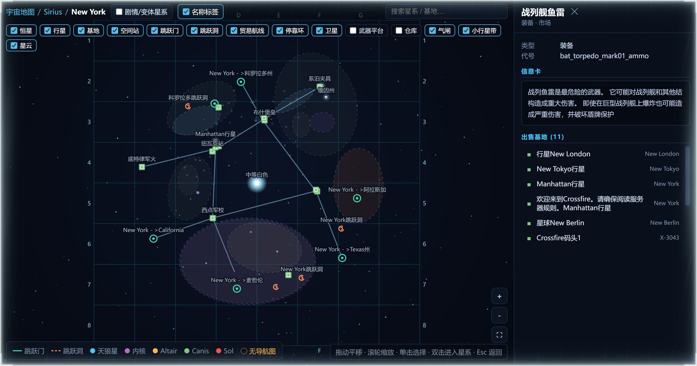
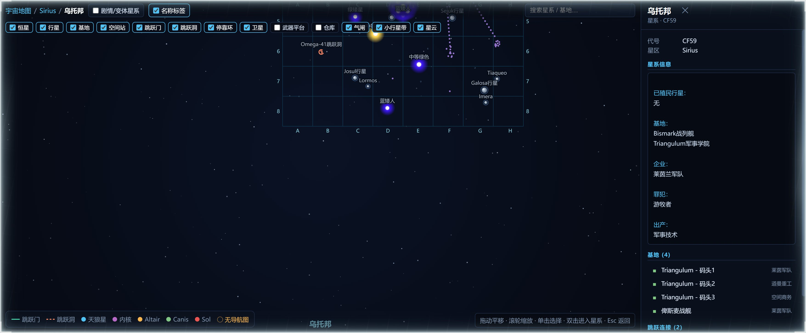

# 自由枪骑兵 Crossfire Mod 中文互动式地图
# Freelancer Crossfire Mod Chinese Interactive Map

一个**离线可用**的 HTML 互动式星系地图，数据直接提取自本机的
**Crossfire Mod 2.0.1（单机版）** 游戏文件，还原游戏内导航图的三层结构：
宇宙（五大赛区）→ 星系（行星/基地/跳跃门）→ 物体详情卡。

> 打开 `index.html` 即用，无需联网、无需安装任何运行环境。



---

## 功能特性

| 层级 | 内容 |
|---|---|
| **大地图** | 5 个星区按官方银河图排列（Canis 右上 / Sol 右 / 内核中 / Altair 左 / Sirius 左下）；162 个正式版星系、352 条跳跃连接（门/洞/随机洞）；无导航图星系橙色标注；房子名称水印 |
| **星系图** | 与游戏内导航图完全一致的坐标方向（x 右、z 下）与 **8×8 网格（A–H / 1–8）**；恒星/行星/基地/空间站/跳跃门/跳跃洞/贸易航线/小行星带/星云 |
| **详情卡** | 物体类型、阵营、坐标、**游戏内信息卡全文**；基地附设施与**出售/收购清单**；点击商品/装备/飞船可查看其信息卡与出售基地 |
| **交互** | 拖动平移、滚轮/按钮缩放、单击选择、双击进入星系、Esc 返回、搜索星系与基地、图层筛选、剧情/变体星系开关、深链接 `#Li01` |

### 星系图（纽约）—— 与游戏内方向/网格一致



### 基地市场清单（商品 / 装备 / 飞船）



### 物品信息卡（点击商品/装备/飞船标签）



### 乌托邦星系（信息卡与网格）



---

## 安装方式

**方式一（推荐）：下载 Release 压缩包**

1. 打开本仓库的 **Releases** 页面，下载最新版的 `FreelancerMap-*.zip`；
2. 解压到任意文件夹（**不要**解压进游戏目录，地图与游戏互不影响）；
3. 双击 `index.html` 即可。

**方式二：克隆仓库**

```bash
git clone https://github.com/MicroHEROX/freelancer-crossfire-map.git
```

然后打开 `index.html`。仓库中的 `docs/`、`tools/`、`screenshots/` 是文档与开发资料，
**不需要**安装到游戏目录。

> 系统要求：任何现代浏览器（Chrome / Edge / Firefox）。纯静态页面，file:// 直接运行。

## 使用方法

| 操作 | 效果 |
|---|---|
| 拖动 / 滚轮 | 平移 / 以鼠标为中心缩放 |
| 右下 ＋ / － / ⛶ | 放大 / 缩小 / 适应窗口 |
| 单击 | 选择并打开信息面板 |
| 双击 | 进入星系 / 打开物体详情 |
| Esc | 从星系图返回大地图；再按关闭面板 |
| 顶部搜索框 | 搜索星系或基地，直达 |
| 顶部开关 | 「剧情/变体星系」显示被排除的任务变体；「名称标签」开关标签 |
| 左侧筛选条 | 控制星系图内物体、贸易航线与区域显示 |

## 卸载 / 删除

地图为纯静态文件，**不写入注册表、不修改游戏**：

- 删除解压出来的整个文件夹即可；
- 克隆用户删除仓库目录即可；
- 无需卸载程序，也不会残留任何数据。

---

## 已实现

- 读取游戏 `universe.ini` / `multiuniverse.ini` / `NoNavMap.ini` / 系统 INI / 原型表 / 阵营表
- 名称与信息卡解析：IDS 公式（含隐式的 `Resources.dll` index 0）、RT_HTML 与 RT_STRING 回退、RDL→HTML、原型回退、语言版本（2052 中文优先）
- 单机最终正式版判定：排除 17 个任务阶段变体 + 1 个剧情专用星系（证据见 `docs/03_解决方案文档.md`）
- 大地图/星系图/详情卡/市场/物品卡、搜索、筛选、缩放控件、深链接
- 与游戏内截图逐项核对方向、网格、星区相对位置

## 未实现 / 已知限制

- **在线（MP）版数据**未提取（服务器端文件与单机不同）
- **残骸（wreck）与矿区**未单独绘制（可作为后续扩展）
- MOD 数据中有 96 条信息卡本身为空字符串（游戏内同样不显示）
- 变体节点在地图上为「正式版附近示意」，不代表游戏内坐标
- 移动端触控未专门优化

## 路线说明（哪些能走 / 哪些不能走）

本图以**单机剧情通关后的自由模式**为最终状态：

| 类别 | 能否到达 | 说明 |
|---|---|---|
| 162 个正式版星系 | ✅ 可走 | 含 352 条跳跃门/跳跃洞连接，以及随机跳跃洞（紫色点线，同一洞口可能去往多个目标） |
| 任务阶段变体（如 `CF01t`、`CF60b`、`CF90b`…） | ❌ 不可走 | 仅剧情任务期间可达，通关后无入口；默认隐藏，可用顶部开关以灰色虚线节点查看 |
| 剧情专用星系（`CF99` Triam） | ❌ 不可走 | 只能由任务强制降落进入，无任何跳跃门 |
| 无导航图星系（`NoNavMap.ini`：`St03` `St03b` `St02c` `CF58` `CF53` `CF41`） | ⚠️ 可走但游戏内无图 | 地图上以橙色圈标注 |
| `CF102` | ❌ 废弃数据 | 孤立系统文件，不在星系清单中 |
| 在线（MP）宇宙 | ❌ 不适用 | 服务器数据与单机不同，本图不包含 |

---

## 数据来源与兼容版本

- 游戏：**Crossfire Mod 2.0.1 Client Edition**（单机）
- 所有名称、信息卡、市场数据均提取自本机游戏文件；地图布局以
  `multiuniverse.ini` 为准（`universe.ini` 的 `pos` 字段 MOD 未维护，存在大量重叠）
- 方向/网格以游戏内导航图截图实测为准

## 重新生成数据（开发者）

```bash
pip install pefile
# 让 tools/ 的上一级同级存在 "Freelancer Crossfire" 游戏目录，或设置环境变量：
set FLCF_GAME=D:\Games\Freelancer Crossfire
python tools/extract_map.py
```

辅助分析脚本：`analyze_variants.py`（变体证据）、`analyze_missions.py`（任务引用统计）、
`system_details.py`（星系详情）、`li01_grid.py`（网格换算核对）、`check_ships.py`（市场标志位核对）。

## 文档

- [`docs/00_工程文档.md`](docs/00_工程文档.md) —— 工程总览、目录结构、关键决策
- [`docs/01_标准术语表.md`](docs/01_标准术语表.md) —— 中英术语与易混辨析
- [`docs/02_API列表.md`](docs/02_API列表.md) —— 数据格式、前端接口、工具脚本
- [`docs/03_解决方案文档.md`](docs/03_解决方案文档.md) —— 问题记录（方向/网格/变体/信息卡/乱码等）

## 致谢

- **DeepSeek** —— 本项目的代码、数据管线与文档均由 DeepSeek 模型辅助完成
- **OpenCode** —— AI 编程环境
- **Freelancer** © Microsoft / Digital Anvil；**Crossfire Mod**（SWAT Portal / OP-R8R 团队）
- **FLCompanion**（Wizou 等）—— IDS 资源机制与市场标志位的参考
- **Python / pefile**、**arbiter.de / Freelancer Fandom Wiki / SWAT Portal** 的参考截图

详见 [`NOTICE.md`](NOTICE.md)。

## 许可

- 本项目代码：**MIT License**（见 [`LICENSE`](LICENSE)）
- `data/` 中的游戏提取文本（名称、信息卡、市场数据）版权归 **Crossfire MOD 作者与汉化作者** 所有，仅用于本地图的展示
